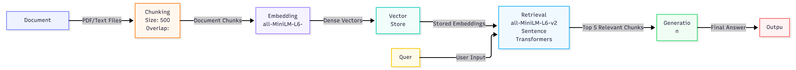

# Project 1 Planning: The Unofficial Guide

> Write this document before you write any pipeline code.
> Your spec and architecture diagram are what you'll use to direct AI tools (Claude, Copilot, etc.) to generate your implementation — the more specific they are, the more useful the generated code will be.
> Update the Retrieval Approach and Chunking Strategy sections if you change your approach during implementation.
> Update this file before starting any stretch features.

---

## Domain

<!-- What domain did you choose? Why is this knowledge valuable and hard to find through official channels? -->

The domain I choose was off campus housing. This knowledge is valuable because when I was once looking for an off-campus house, there was a lot of options, all of them would try to pressure buyers to sign with them asap, making them think the prices would skyrocket after a certain date or that they would run out of spots in October. This is far from true, as these off campus housing locations have deals and openings even in the Spring semester. Because of this, I wish I had more condensed information, more knowledge of the deals these complexes run, and knew about some apartments that I had only learned about after I signed a lease.

---

## Documents

<!-- List your specific sources: URLs, subreddit names, forum threads, or file descriptions.
     Aim for at least 10 sources that together cover different subtopics or perspectives within your domain. -->

| #   | Source                | Description                                                             | URL or location                                                                                          |
| --- | --------------------- | ----------------------------------------------------------------------- | -------------------------------------------------------------------------------------------------------- |
| 1   | asu.edu               | Official ASU off-campus housing search and listing portal.              | https://offcampushousing.asu.edu/                                                                        |
| 2   | Reddit                | Student discussion about off-campus apartment recommendations near ASU. | https://www.reddit.com/r/ASU/comments/y6pbzt/offcampus_apartments/                                       |
| 3   | forrentuniversity.com | Rental listings near ASU Downtown Phoenix campus.                       | https://www.forrentuniversity.com/Arizona-State-University-Downtown-Phoenix-Campus                       |
| 4   | student.com           | Student housing marketplace with Phoenix accommodation options.         | https://www.student.com/us/phoenix                                                                       |
| 5   | Reddit                | Advice and experiences on ASU off-campus accommodation.                 | https://www.reddit.com/r/ASU/comments/1lea94p/offcampus_accommodation_help/                              |
| 6   | Facebook              | Community group post for ASU housing rentals.                           | https://www.facebook.com/groups/asu.off.campus.housing.arizona.state.rentals/posts/2081825209009541/     |
| 7   | gyandhan.com          | Tips for choosing off-campus housing near ASU Tempe.                    | https://discussions.gyandhan.com/t/things-to-know-before-picking-off-campus-housing-near-asu-tempe/16496 |
| 8   | ramblertempe.com      | Guide to popular housing options for ASU students.                      | https://ramblertempe.com/resources/where-do-asu-students-live-housing-options-beyond-greek-housing/      |
| 9   | Reddit                | Student recommendations for best off-campus apartments near ASU.        | https://www.reddit.com/r/ASU/comments/1jqarh9/best_offcampus_apartments/                                 |
| 10  | nau.edu               | NAU's off-campus housing and roommate listing service.                  | https://louieslist.nau.edu/                                                                              |

---

## Chunking Strategy

<!-- How will you split documents into chunks?
     State your chunk size (in tokens or characters), overlap size, and explain why those
     numbers fit the structure of your documents.
     A review-heavy corpus warrants different chunking than a long FAQ. -->

**Chunk size:** 500

**Overlap:** 100

**Reasoning:** A chunk size of 500 characters balances semantic completeness with retrieval precision by keeping related information together while avoiding overly large chunks that may contain multiple topics. A 100-character overlap preserves context across chunk boundaries and reduces the risk of important information being split between adjacent chunks. This configuration works well for general text documents, FAQs, and web content where relevant information is often contained within a few paragraphs.

---

## Retrieval Approach

<!-- Which embedding model are you using (e.g., all-MiniLM-L6-v2 via sentence-transformers)?
     How many chunks will you retrieve per query (top-k)?
     If you were deploying this for real users and cost wasn't a constraint, what tradeoffs
     would you weigh in choosing a different embedding model — context length, multilingual
     support, accuracy on domain-specific text, latency? -->

**Embedding model:** all-MiniLM-L6-v2

**Top-k:** 5

**Production tradeoff reflection:** The all-MiniLM-L6-v2 model provides a good balance between retrieval quality, speed, and computational cost, making it well suited for educational and prototype RAG systems. Retrieving the top 5 chunks generally provides enough context for answer generation while limiting irrelevant information. The tradeoff is that larger models typically require more memory, increase embedding latency, and raise infrastructure costs, so the choice would depend on application requirements and expected query volume.

---

## Evaluation Plan

<!-- List your 5 test questions with their expected correct answers.
     Questions should be specific enough that you can judge whether the system's response
     is right or wrong. "What are good dining halls?" is too vague.
     "What do students say about wait times at [dining hall name] during lunch?" is testable. -->

| #   | Question                                                                                                           | Expected answer                                                                 |
| --- | ------------------------------------------------------------------------------------------------------------------ | ------------------------------------------------------------------------------- |
| 1   | Which apartment complexes do students most frequently recommend in the Reddit thread "Best Off-Campus Apartments"? | Specific apartment names                                                        |
| 2   | What concerns do students raise about choosing off-campus housing near ASU Tempe?                                  | Cost, commute distance, roommates, safety, and lease terms.                     |
| 3   | What advice do students give international students seeking off-campus accommodation in the Reddit help thread?    | Start searching early, compare leases, and verify transportation/accessibility. |
| 4   | What do students say about the living experience and amenities in University House (UH)?                           | Real good or bad reviews                                                        |
| 5   | What alternatives to Greek housing are discussed in the Rambler Tempe article?                                     | Off-campus apartments, student communities, and shared housing options.         |

---

## Anticipated Challenges

<!-- What could go wrong? Name at least two specific risks with reasoning.
     Consider: noisy or inconsistent documents, missing source attribution, off-topic
     retrieval, chunks that split key information across boundaries. -->

1. Missing source attribution to be able to answer specific questions about singular or groups of apartments/housing.

2. Off-topic retrieval bringing up useless information from the websites relative to the question, or reviews about a different location or a broad category when asked about a specific location.

---

## Architecture

<!-- Draw a diagram of your pipeline showing the five stages:
     Document Ingestion → Chunking → Embedding + Vector Store → Retrieval → Generation
     Label each stage with the tool or library you're using.
     You can use ASCII art, a Mermaid diagram, or embed a sketch as an image.
     You'll use this diagram as context when prompting AI tools to implement each stage. -->

## AI Tool Plan

<!-- For each part of the pipeline below, describe:
     - Which AI tool you plan to use (Claude, Copilot, ChatGPT, etc.)
     - What you'll give it as input (which sections of this planning.md, which requirements)
     - What you expect it to produce
     - How you'll verify the output matches your spec

     "I'll use AI to help me code" is not a plan.
     "I'll give Claude my Chunking Strategy section and ask it to implement chunk_text()
     with my specified chunk size and overlap" is a plan. -->

**Milestone 3 — Ingestion and chunking:** I'll give Claude my Chunking Strategy section and ask it to implement chunk_text() with my specified chunk size and overlap. I expect it to produce a clean and working chunk_text() and will print good quality and retrivable chunks according to my specifications and will verify by checking the number of chunks, the size of the chunks, and the size of the overlaps.

**Milestone 4 — Embedding and retrieval:** I'll give Claude my Retrieval Strategy section and ask it to implement a retireval function and a function that embeds my chunks. I expect queries that specific, on-topic, and from the right source. To verify the output matches my specifications, I will print the retrieved chunk in full, check distance scores, check chunk content, and check metadata.

**Milestone 5 — Generation and interface:** I'll give Claude my diagram and planning.md to generate the generation code and interface code. It should produce both a good and grounded response that is traceable to retrieved text with sources cited, as well as a good Gradio web UI. I will verify the output by checking if the responses it produces are grounded and have cites and testing with multiple responses.
